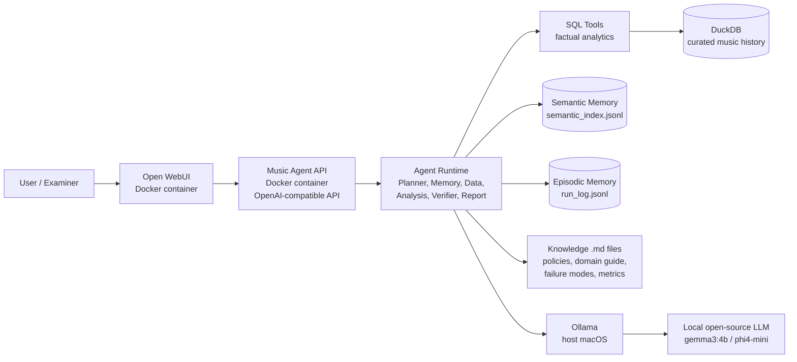
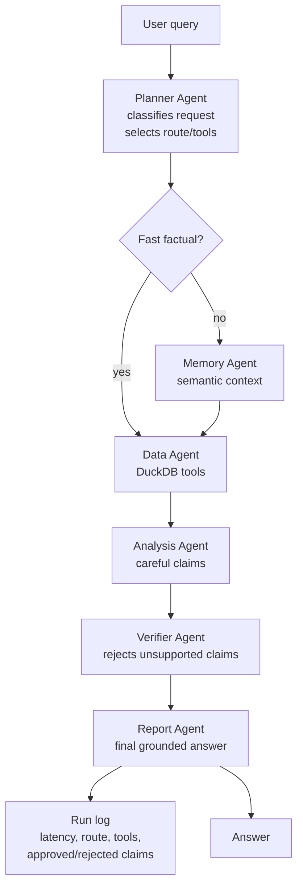
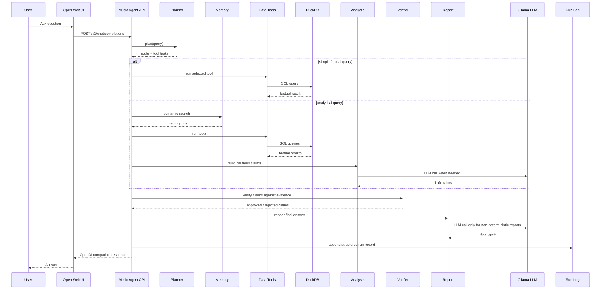
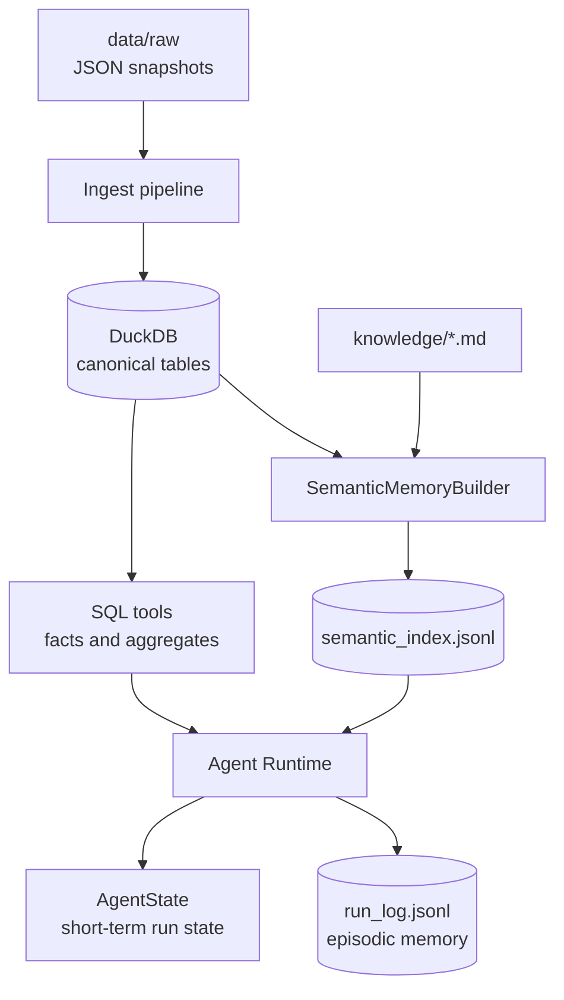

# Architecture Diagrams

Этот файл нужен для устной защиты: сначала показываем стек и диаграммы, потом по ним объясняем flow агента.

## 1. Стек по пунктам задания

| Пункт | Решение |
|---|---|
| Local LLM runtime | `Ollama` |
| Рассмотренные runtime | `Ollama`, `llama.cpp`, `MLX-LM`, `LM Studio`, `vLLM` |
| Основная LLM | `gemma3:4b` |
| Backup LLM | `phi4-mini` |
| Протестированные LLM | `gemma3:4b`, `phi4-mini`, `llama3.2:3b`, `qwen3:4b` |
| Agent framework | custom orchestration в MVP |
| Рассмотренные фреймворки | `LangGraph`, `LangChain`, `CrewAI`, `AutoGen` |
| Следующий кандидат framework | `LangGraph` |
| Agent API | OpenAI-compatible HTTP API |
| UI | `Open WebUI` |
| Structured storage | `DuckDB` |
| Semantic memory | JSONL semantic index |
| Episodic memory | JSONL run log |
| Isolation | `Ollama` на host, agent app + WebUI в Docker Compose |
| Evals | model eval docs + agent eval runner |
| Observability MVP | structured run log |
| Target observability | OpenTelemetry, Langfuse, Prometheus, Grafana, Loki, Alertmanager |

## 2. C4 Container Diagram

Как объяснять: пользователь общается не с голой LLM, а с `Music Agent API`. Агент сам выбирает маршрут, вызывает tools, проверяет claims и только потом формирует ответ.

## 3. Agent Flow

Как объяснять: простые factual-вопросы идут коротким путём, чтобы не тратить LLM-вызовы. Аналитические вопросы проходят через memory, analysis и verifier.

## 4. Sequence Diagram

Как объяснять: verifier стоит после analysis и перед report, поэтому финальный ответ не должен включать неподтверждённые утверждения.

## 5. Memory Diagram

Как объяснять: DuckDB является source of truth. Semantic memory помогает контекстом, но не заменяет факты. Поэтому naive RAG не выбран как основной подход.

## 6. Что показать первым на защите

1. Стек из раздела 1.
2. C4 Container Diagram.
3. Agent Flow.
4. Sequence Diagram.
5. Потом коротко пройтись по пунктам задания.

